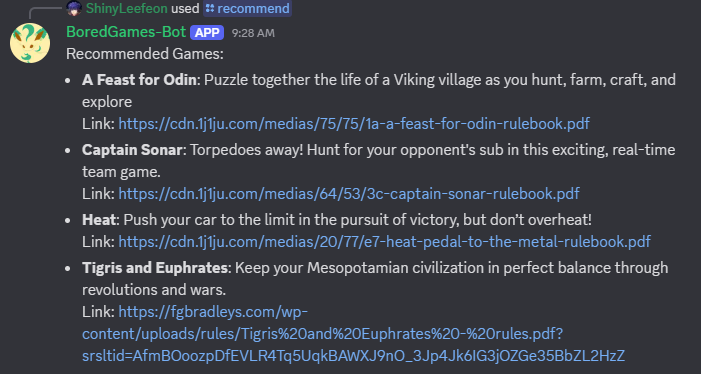

# BoredGames-bot
A discord bot with various utilities for your (my) weekly board game group
The main utility that I focused on was creating a database with games stored from a spreadsheet specified at setup, and then recommending games via a discord command with the specified parameters.

## Setup

Create/edit a .env file in the root with this information:

Since containerization is broken, the best way to setup will be to download the package, navigate to it in a terminal and go run .
DiscordBotToken= (You will need to make a discord bot account)

DefaultGuildID= (The id of the server you want to use it in)

DB_Path= (Should be ./boredgames.db)

GOOGLE_APPLICATION_CREDENTIALS= (Will need to setup a spreadsheet with games and a google api account to access it)

SPREADSHEET_ID= (Link to boardgame spreadsheet)

Afterwards you should be able to do go run . to start the bot, it will automatically create the database and sync any games from the spreadsheet to it.
There are some commands it will register to the discord guild you specify, namely "Create event" and "Recommend" the usage should be straightforward and handled via the discord gui

This bot is pretty much just for me but feel free to reach out to me if you want to use it.

!TODO 
Containerization is broken. I suspect I just need to add some parameters at setup and store a credentials file supplied by the user.
Add any functionality I think of
